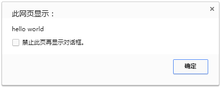

# 入门

## 前言

这是 Javascript 的第一篇入门教程。在阅读这篇文章之前，如果你有学过 Java 或 C 等编程语言，那么学 Javascript 的很轻松的。如果没学过，阅读本文可能会比较吃力。不过这也没关系，本教程并不要求读者具备编程相关的知识，只要懂一点 HTML 相关的知识就可以了。

## 准备

在学习本系列文章前，你需要：

1. 了解基本的 HTML 知识。
2. 安装最新的浏览器。本系列文章所有示例都能在浏览器直接运行，除了：
    * ES6 模块化。

## 写个 Hello world

新建 HTML 文件，把下面内容粘贴进去

```
<!DOCTYPE html>
<html>
<head>
<meta charset="utf-8">
</head>
<body>

<script>
    alert('hello world');
</script>
</body>
</html>
```

浏览器打开 HTML 文件，可以看到浏览器弹出了一个弹窗：



`script` 元素表示元素里面是一段脚本（代码），浏览器会逐行执行里面的代码。

## 语句

在 Javascript 中，代码是一行一行执行的。一般情况下，一行代码是一个语句。
当然，一行代码也是可以写多个语句的，虽然不建议这么做。比如这行代码就有两个语句：
```
var a = 123; console.log(a)
```
每个语句一般用分号分隔开。在 Javascript 中，分号不是必须的。一般书上的说法是，为了规范和避免不必要的错误，每个语句必须以分号结尾。其实未必的，关于分号的话题，这里不再过多讨论。

## 变量

简单地讲，变量是和常量相对应的，值固定不变的量就叫常量，值不是固定的量就叫做变量。

举个栗子：

```
var x = 1; // 定义一个变量 x，赋值为 1
x = 2; // x 重新赋值为 2
```

## 注释

代码是给机器看的，有时候我们需要在代码旁写点备注信息，解释这段代码。

```javascript

```

## 顺序结构

前面说过，代码是按照语句是顺序逐语句执行的。

// TODO 未完待续。