# CSS 学习笔记 - Flex 布局

## 传统布局方式的局限性

传统的网页布局方式，采用 `display` + `position` + `float` 的方式来实现。这种方式，无法实现一些复杂的布局，并且在实现某些布局时，会有一些局限性。

比如，最常见的多列布局，我们一般是通过 `float` 来实现的。这种方式并不是标准，`float` 属性一开始是用来实现文字环绕图片的效果，后来人们发现这货比 `display: inline` 之类的属性好用，便用它来实现多列布局。

再如，垂直居中的实现，也是各种奇淫技巧，并没有标准的实现方式。

即使是最简单的水平居中，也经常通过 `margin: 0 auto` 来实现的。虽然居中的功能是实现了，但从语义方面来说，这种写法也不是很规范。

当然，并不是说，非标准的就是不好。但是非标准的方式，对新手来说，往往学习成本比较高，并且还有各种副作用。比如用 `float` 实现布局需要我们手动清除浮动，而清除浮动的方式也是各种奇淫技巧。

本文介绍的Flex 布局，能为我们解决这些问题。

这篇文章主要介绍 Flex 相关的概念和每一个属性的用法。

## Flex 布局是什么

Flex 布局是 Flexible Box 的缩写，也叫做弹性布局。我们可以通过下面的方式来实现 Flex 布局。

```
.box {
    display: -webkit-flex;
    display: flex;
}
```

设置了 `display: flex` 的元素，其子元素 的 `float`、`clear` 和 `vertical-align` 属性将会失效。

## Flex 模型介绍

在学习 Flex 的用法之前，我们先来学习 Flex 的基本概念。


* 设置了 `display: flex` 的元素称为 Flex 容器（flex container）、其子元素称为 Flex 项（flex item）。
* 默认水平方向为主轴（main axis）、主轴开始位置称为 main start，主轴结束位置称为 main end。
* 与主轴垂直的轴是交叉轴（cross axis），交叉轴开始位置称为 cross start，交叉轴结束位置称为 cross end。

## Flex 容器

Flex 容器支持以下六个属性：

* flex-direction
* flex-wrap
* flex-flow
* justify-content
* align-items
* align-content

### flex-direction

`flex-direction`属性用来设置主轴的方向。它有以下四个值。

`row`（默认值）：水平向右为主轴方向。

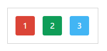

`row-reverse`：水平向左为主轴方向。

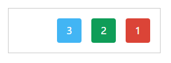

`column`：垂直向下为主轴方向。

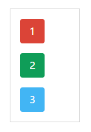

`colunm-reverse`：垂直向上为主轴方向。

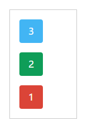

主轴和交叉轴是相互垂直的，也就是说，如果设置了主轴的方向为垂直方向，那么交叉轴的方向就是水平方向。

## flex-wrap

`flex-wrap` 属性用来设置 Flex 项的换行方式。它有以下三个值。

`nowrap`（默认值）：不换行。


`wrap`：换行。

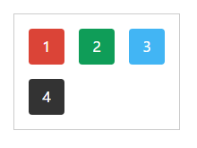

`wrap-reverse`：换行，先排最后一行。

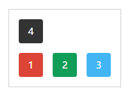

## flex-flow

`flex-flow` 属性是 `flex-direction` 与 `flex-wrap` 的缩写。默认值 `row nowrap`。

```
flex-flow: flex-direction flex-wrap;
```

## justify-content

`justify-content` 属性用来设置 Flex 项在主轴上的排列方式。它有以下五个值。

`flex-start`（默认值）：从 main start 开始排列。

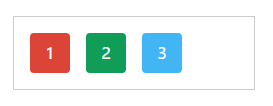

`flex-end`：从 main end 开始排列。

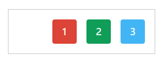

`center`：在主轴上居中。

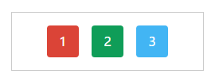

`space-between`：两端对齐。Flex 项之间的距离相等。

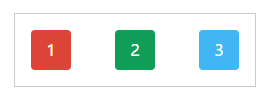

`space-around`：每一个 Flex 项左右的距离相等。两项之间的距离是旁边的距离的两倍。

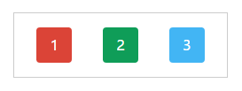

## align-items

`align-items` 属性用来设置 Flex 项在交叉轴上的对齐方式。它有以下五个值。

`flex-start`：交叉轴的起始位置（cross start）对齐。

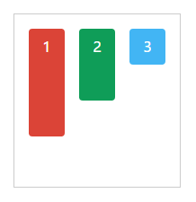

`flex-end`：交叉轴的结束位置（cross end）对齐。


`center`：交叉轴的中点对齐。

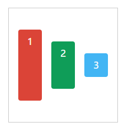

`baseline`: Flex 项的第一行文字的基线对齐。

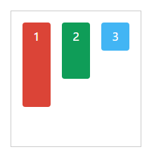

`stretch`（默认值）：Flex 项目将占满整个 Flex 容器的高度。但是如果 Flex 项设置了高度，该属性不起作用。

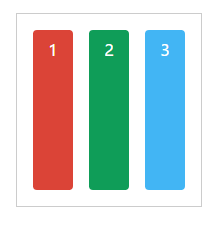

## align-content

`align-content` 属性用来设置交叉轴上多行对齐方式，类似于 `justity-content`。这个属性只有在交叉轴上的行数大于一时才起作用。它有以下六个属性。

`stretch`（默认值）：多行占满整个轴线。

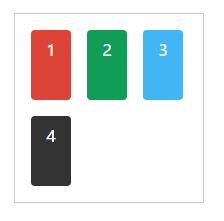

注意：如果 Flex 设置了高度，这个属性不起作用。

`flex-start`：与交叉轴的起始位置对齐。

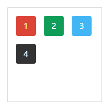

`flex-end`：与交叉轴的结束位置对齐。

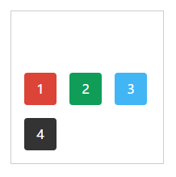

`center`：与交叉轴的中点位置对齐。

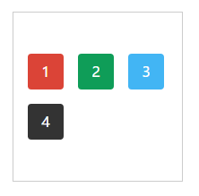

`space-between`：在交叉轴上两端对齐，每行之间的距离相等。

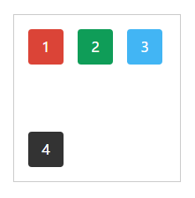

`space-around`：每行的上下距离相等。两行之间的间距是最上面和最下面的间距的两倍。

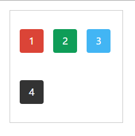

## Flex 项

Flex 项支持以下属性：

* order
* flex-grow
* flex-shrink
* flex-basis
* flex
* align-self

### order

`order` 属性用来设置 Flex 项的顺序。默认为 `0`。数值越小，Flex 项越排在前面。

```
.item:nth-child(1){
    order: 3;
}
.item:nth-child(2){
    order: 2;
}
.item:nth-child(3){
    order: 1;
}
```

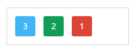

### flex-basis

`flex-basis` 属性用来设置 Flex 项的宽度，用法与 `width` 一样。可以当做是 `width` 的别名。默认值为 `auto`。如果元素同时设置了 `flex-basis` 属性和 `width` 属性，`flex-basis` 属性会覆盖 `width` 属性，即 `width` 属性不会起作用。

如果是 Flex 项，建议使用 `flex-basis` 而不是 `width`，这样比较符合规范。

### flex-grow

`flex-grow` 属性用来设置，当 Flex 容器的宽度大于所有 Flex 项目的宽度的总和时，剩下的空间如何分配给子元素。若 Flex 容器的宽度小于或等于所有 Flex 项目宽度的总和，即没有剩余空间，该属性不会起作用。

对于 `flew-grow` 大于 1 的 Flex 项，会按照 `flew-grow` 的值的比例分配剩余的空间。比例越大，分配的就越大。`flew-grow` 值为 2 的 Flex 项分配到的宽度是`flew-grow` 值为 1 的两倍。

默认值是 `0`，即按原先的大小显示，不需要分配额外的宽度。

举个例子，Flex 容器中共有三个 Flex 项，他们 `flew-grow` 的值分别为 0、2、3。则第二个 Flex 项目的最终宽度为：原先的宽度 + 剩余的宽度 * 2 / (2 + 3)。

### flex-shrink

`flex-shrink` 属性用来设置，当 Flex 容器的宽度小于所有 Flex 项目宽度的总和，即空间不足时，Flex 项如何缩小宽度。只有空间不足时，该属性才会起作用。

值越大，减小的就越大。值为 0，表示不减小。默认值为 `1`。 

关于减小后的宽度的计算还是有点麻烦的，鉴于篇幅有限，不再此说明。

### flex

`flex` 属性是 `flex-grow`、`flex-shrink` 和 `flex-basis` 的缩写。默认值为 `1 1 auto`。

```
flex: flex-grow flex-shrink flex-basis;
```

### align-self

Flex 容器的 `align-items` 属性会作用于所有 Flex 项，如果你希望某个 Flex 项不遵循 `align-items` 属性设置的值，可以用 `align-self` 属性覆盖。用法与 `align-items` 一致。

## 总结

Flex 布局会是未来布局的首选，尽管在兼容性方面还是有点不足。你可以根据下面的脑图，回顾一下这篇文章讲解过的知识。

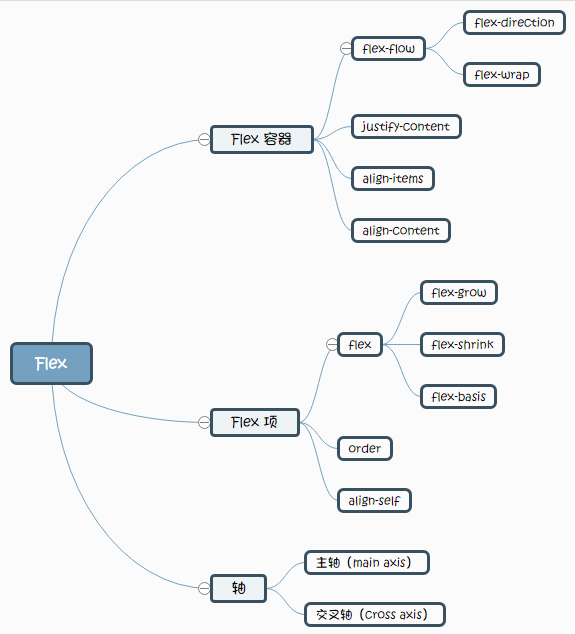

下一篇文章，会讲解如何用 Flex 实现常见的布局。

## 参考

* [Flexbox](https://developer.mozilla.org/en-US/docs/Learn/CSS/CSS_layout/Flexbox)


交叉轴的方向
