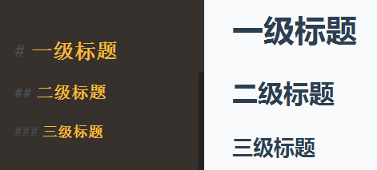
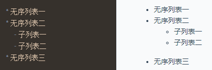
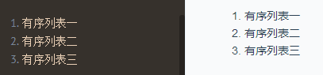
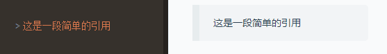

## 前言

markdown 是一种标记语言，语法简单，入门容易，被越来越多的写作爱好者所使用，也被越来越多的文本写作工具、网站所支持。我使用 markdown 已经两年了，平时写笔记、文档或是博客，都是用 markdown 书写的，深深感到 markdown 确实大大提高了写作的便利。网上关于 markdown 的教程已经多到泛滥了，但我还是写了这篇文章，谈谈我对 markdown 的看法，顺便为 markdown 的推广尽点绵薄之力。

## 为什么学习 markdown？

* 如果你有写文字或做笔记的需求，那么一款支持富文本的编辑器或软件是必不可少的？
* 如果用了 word 或其他第三方软件，别人没有安装相应的软件，他就无法浏览你写的内容。
* 如果你追求效率，你肯定希望能脱离鼠标操作。
* 如果你只想专心地写作，不希望编辑器自带了一堆乱七八糟的用不上的功能。
* 如果你想随时随地在任何一部电脑快速地写作，不想安装任何软件。

那么，我推荐你使用 markdown。

## 语法

首先推荐一个在线的 markdown 编辑器：[马克飞象](https://maxiang.io/)，这篇文章就是在这个编辑器上撰写出来的。你也可以把下面的示例复制粘贴在网站左边的编辑器，在右边看预览效果。

### 标题

写作中，标题是常用的格式。在 markdown 中，我们只需在文字前面加上 `#`（文字和符号之间最好加一个空格），就可以表示标题了。

```markdown
# 一级标题

## 二级标题

### 三级标题
```

预览效果如下：



markdown 支持六级标题。

### 列表

编辑器输入以下内容：

```markdown
* 无序列表一
* 无序列表二
	- 子列表一
	- 子列表二
* 无序列表三
```

预览效果：



编辑器输入以下内容：

```markdown
1. 有序列表一
2. 有序列表二
3. 有序列表三
```

预览效果：



### 引用

编辑器输入以下内容：

```markdown
> 这是一段简单的引用
```

预览效果：



### 超链接

超链接的格式：\[链接文字\]\(链接地址\)

比如百度的链接：

```markdown
[百度一下](https://www.baidu.com/)
```

### 图片

图片的格式：!\[图片提示文字\]\(图片地址\)

```markdown

```

### 其他语法

markdown 的语法还不止这些，但上面的语法基本够用了。这篇文章只是起到一个入门的引导作用，不再深入讲述 markdown 语法。

## 工具

在线 markdown 编辑器：

* [马克飞象 - 专为印象笔记打造的Markdown编辑器](https://maxiang.io/)
