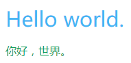
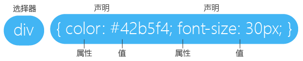

# CSS 学习笔记 - Hello world

## 简单示例

在学习 CSS 之前，我们先来运行个简单的示例。

`css-demo/hello.html`：

```
<!DOCTYPE html>
<html>
<head>
	<meta charset="utf-8">
	<style>
		div {
			color: #42b5f4;
			font-size: 30px;
		}
		p {
			color: #0f9d58;
		}
	</style>
</head>
<body>
<div>Hello world.</div>
<p>你好，世界。</p>
</body>
</html>
```

运行效果是这样的：



其中，`style` 元素是用于书写 CSS 语法的地方。

## 基本语法

我们来分析上面的示例：



* CSS 采用属性（Property）和值（Value）这种键值对的方式来描述元素的样式，我们把一个键值对称为一个声明（declaration）。
* 多个声明组合成声明块（declarations blocks），用英文大括号包围起来。
* 选择器（collector）用于描述选择器后面的声明块作用于哪一个元素。
* 选择器和后面的声明块组成了一个规则（ruleset）。


