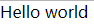

# D3.js 学习笔记 - Hello world

## 源码和效果

项目源码：

```
<!DOCTYPE html>
<html>
<head>
    <meta charset="utf-8">
    <title>d3.js 学习笔记</title>
    <style>
        * {
            padding: 0;
            margin: 0;
            box-sizing: border-box;
        }
    </style>
</head>
<body>
</body>

<script src="https://d3js.org/d3.v4.min.js"></script>
<script>
    d3.select('body').append('p').text('Hello world')
</script>
</html>
```

新建一个 HTML 文件，粘贴源码，浏览器直接打开。

效果：



## 源码分析

如果你使用过 JavaScript DOM API 或 jQuery，那么你应该能看出这段 JavaScript 代码是什么意思。

`d3.select('body')` 选择 `body` 元素，`.append('p')` 为 `body` 节点添加了一个 `p` 元素，`.text('Hello world')` 设置 `p` 元素的内容为 `Hello world`。


