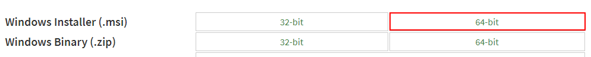

# Node.js 学习笔记 - 安装

第零步，进入官方下载地址：[https://nodejs.org/en/download/](https://nodejs.org/en/download/)，下载 64 位的 mis 安装文件，双击安装，使用默认安装选项即可。



第二步，查看是否安装成功。

命令行执行 `node -v`，显示版本信息则说明安装成功。

```text
$ node -v
v6.11.0
```


