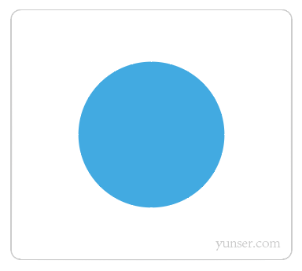

## 前言

网页实现绘图，除了图片和元素的方式外，有两种方式：Canvas 和 SVG。后者就是这篇文章的主角。这篇文章不讲解 SVG 相关的语法，只是简单地介绍什么是 SVG 以及 SVG 的用途，适合没了解过 SVG 的读者。

在阅读本文前，如果你没了解过 XML，你需要了解一点 XML 相关的知识：[XML 学习笔记](http://www.chenjianhang.com/1833.html)。

## 矢量图与位图

说起 SVG，就不得不说矢量图。简单地讲，矢量图就是用直线和曲线来描述图像，而不是像位图那样，描述每一个像素点的颜色。

举个栗子：



对于上面的图形，矢量图一般是这样描述图像的：以 (100, 100) 为圆心，绘制半径为 50 的圆，填充蓝色。而位图是这样描述图像的：第 1 个像素点是白色，第 2 个像素点是白色，第 3 个像素点是白色，……，第 1234 个像素点是蓝色，……。

由此可见，对于不是很复杂的图形，矢量图这种基于数学定义的图像，通常文件体积会更小，同时也说明，矢量图不适合用于描述复杂的图像。

当然，这不是重点，矢量图的优势在于：图像可以放大任意倍数而不失真。

对于上面的图片，矢量图放大 24 倍后，还可以看到清晰的图形边缘：


而 png 图片才放大几倍，就已经出现锯齿边缘了：


常见的图像格式，如 png、jpg 或者 gif 等等，基本都是位图。矢量图也有很多种格式，svg 就是其中一种。

## svg 格式文件

为了更方面理解，我们来动手用 SVG “画”一个圆形。

首先新建一个 svg 格式文件（如：test.svg），用文本编辑器打开。

然后复制下面代码，粘贴到编辑器，保存。

```
<?xml version="1.0" encoding="utf-8"?>
<svg version="1.1" xmlns="http://www.w3.org/2000/svg" xmlns:xlink="http://www.w3.org/1999/xlink" x="0px" y="0px"
	 viewBox="0 0 240 240" xml:space="preserve">
<circle id="XMLID_1_" class="st0" cx="120" cy="120" r="60" fill="#49AAE1"/>
</svg>
```

最后，用浏览器打开 svg 文件或把 svg 文件拖拽到浏览器。我们就可以在浏览器上看到一个蓝色的圆形。

而这段代码中，`svg` 元素定义了一个 SVG 图像，`circle` 元素定义了一个以坐标 (120, 120) 位圆心，半径为 60px，填充蓝色（#49AAE1）的圆形。

## 什么是 SVG

看到这里，如果你了解过 XML 的话，我想你应该知道 SVG 大概是什么东西了。

我们先来看 SVG 的定义：

> 可缩放矢量图形是基于 XML （可扩展标记语言），用于描述二维矢量图形的一种图形格式。它由万维网联盟制定，是一个开放标准。 - 百度百科

从定义可知，SVG（Scalable Vector Graphics）意为可缩放矢量图形，采用 XML 来描述图像。

SVG 支持的元素有很多，除了 圆形外，还支持椭圆、矩形、直线、折线、多边形、路径等基本形状，这些基本组合起来，便可以绘制任何复杂的图形。除此之外，SVG 还支持路径剪裁、渐变、阴影等功能。

当然，如果 SVG 仅仅是上面这些功能，我没必要写这篇文章来介绍这货。SVG 更强大的优势在于：**SVG 支持 CSS 动画、支持 JavaScript 操作 SVG 节点**，JavaScript 和 CSS3 赋予了 SVG 强大的生命力。

// TODO 未完待续